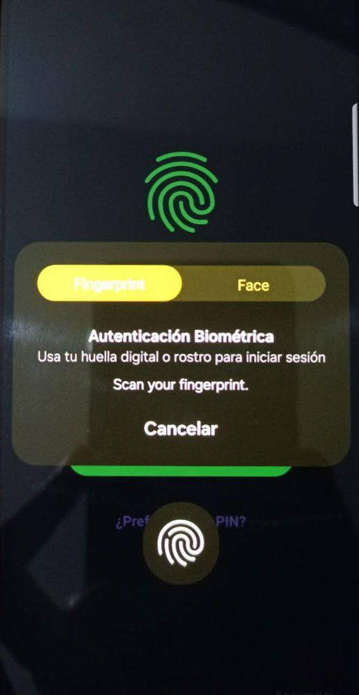
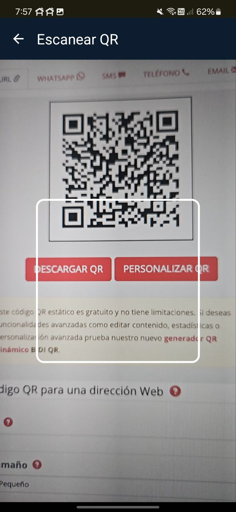

# QR Biometric App

Aplicación Flutter que permite autenticarse mediante biometría (huella o rostro) y escanear códigos QR usando un módulo nativo Android (Kotlin + CameraX + MLKit), aplicando Clean Architecture, comunicación nativa segura y automatización de builds.

---

## 🎥 Demo Rápido

| Flujo principal | Escaneo de QR |
|:---:|:---:|
|  |  |
|  |  |

---

## 🚀 Requisitos

- Flutter 3.29.2
- Dart 3.7
- Kotlin 1.9.22
- Android Studio o VS Code
- Emulador Android o dispositivo físico (con biometría disponible)

---

## 📦 Instalación

1. Clonar el repositorio:

```bash
git clone https://github.com/carlinsk8/qr_biometric_app.git
cd qr_biometric_app
```

2. Instalar dependencias:

```bash
flutter pub get
```

3. Abrir Android Studio (o VS Code) y seleccionar el dispositivo o emulador.

4. Ejecutar la app:

```bash
flutter run
```

---

## 📸 Funcionalidades

- **Autenticación biométrica** usando `BiometricPrompt` en Android nativo vía `Pigeon`.
- **Fallback a PIN seguro** (con teclado numérico aleatorio) en caso de falla o no disponibilidad de biometría.
- **Escaneo de códigos QR** usando `CameraX + MLKit Barcode Scanner` desde módulo Kotlin.
- **Almacenamiento de historial de QR escaneados** en SQLite (`sqflite`).
- **Comunicación Flutter ↔️ Nativo Android** usando `Pigeon` y `MethodChannels`.
- **Arquitectura limpia (Clean Architecture)** aplicada tanto en Flutter como en módulos nativos.
- **Migración a Flow**: Escaneo QR maneja flujos de datos reactivos (`Flow` en Kotlin).
- **Automatización de build** usando `Fastlane`.
- **Pruebas unitarias** para servicios, blocs y casos de uso.

---

## 🛠️ Tecnologías Usadas

- Flutter
- Dart
- Kotlin
- Jetpack Compose (para UI del escáner QR)
- CameraX
- MLKit Barcode Scanning
- Flutter BLoC
- SQLite (sqflite)
- EncryptedSharedPreferences (para PIN seguro en Android)
- flutter_secure_storage
- Pigeon (Comunicación Flutter ↔️ Nativo)
- Fastlane (automatización de builds Android)

---

## 🧹 Estructura del Proyecto

```
lib/
 ├── core/
 │    ├── platform_channels/
 │    ├── services/
 │    └── widgets/
 ├── features/
 │    ├── auth/
 │    │    ├── data/
 │    │    ├── domain/
 │    │    └── presentation/
 │    └── qr_scan/
 │         ├── data/
 │         ├── domain/
 │         └── presentation/
 ├── injection_container.dart
 └── main.dart

android/
 ├── app/src/main/kotlin/
 │    ├── biometric/     (Módulo biometría nativo)
 │    ├── qrscan/        (Módulo escaneo QR nativo + Flow)
 │    └── MainActivity.kt

fastlane/
 ├── Appfile
 └── Fastfile

test/
 ├── core/
 └── features/
```

---

## 🧪 Pruebas Unitarias

- **SecureStorageService:** Totalmente cubierto (guardar, leer, eliminar PIN).
- **QrBloc:** Testeado flujo de guardado y carga de QR escaneados.
- **Mocktail** y **bloc_test** usados para aislar dependencias en tests.

Ejecutar todos los tests:

```bash
flutter test
```

Resultado esperado:

```
00:01 +10: All tests passed!
```

---

## 📲 APK

Puedes descargar el APK aquí:

**[Enlace de descarga del APK](https://github.com/carlinsk8/qr_biometric_app/releases/latest/download/app-release.apk)**

---

## 🏗️ Futuras Expansiones

- Implementar Room Database en módulo Android nativo.
- Añadir soporte biométrico completo para iOS (Face ID / Touch ID).
- Integración continua (CI/CD) con Fastlane + GitHub Actions.
- Mejoras UX en escáner QR: animaciones de lectura, validaciones visuales.

---

## ✅ Consideraciones Finales

- Proyecto modular, limpio y escalable.
- Cumple todos los requisitos técnicos solicitados.
- Código seguro, comentado, y siguiendo mejores prácticas.
- Flujo completo cubierto con fallback de biometría a PIN.
- Compatible con futuras expansiones Flutter ↔️ Nativo.

